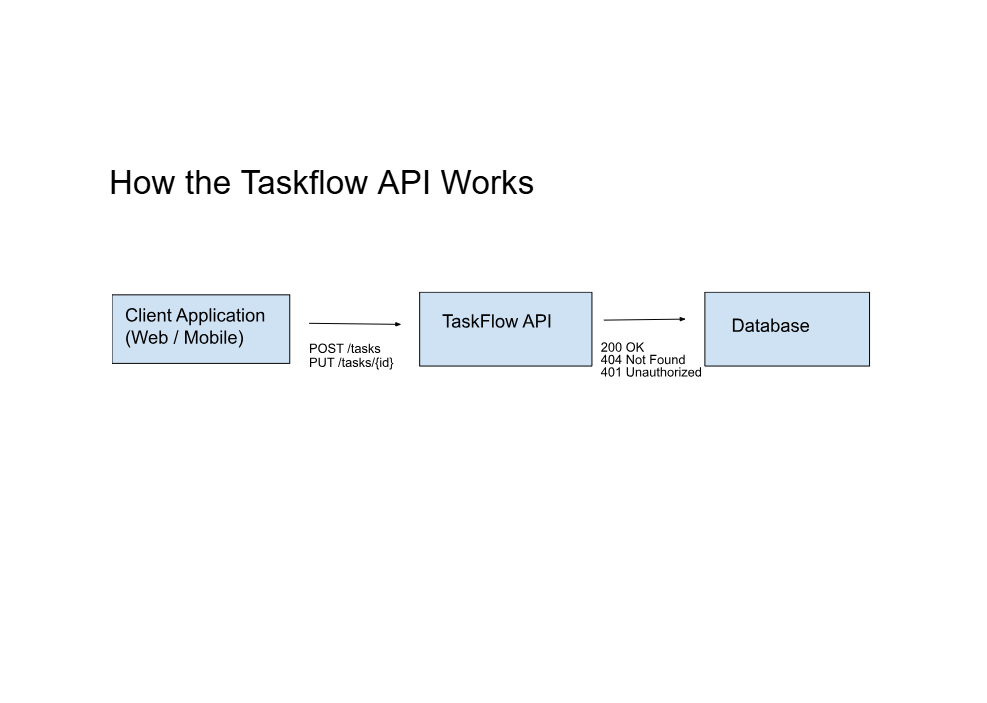

# Getting Started

This guide walks you through making your first request to the TaskFlow API.

## API Environment

The TaskFlow API used in this documentation is a **sample API created for documentation and demonstration purposes**.

The endpoints, requests, and responses represent realistic API behavior, but the service is not publicly hosted.

## Base URL

Example base URLs used in this documentation:

**Production (example):**
https://api.taskflow.dev/v1
**Local development (example):**
http://localhost:3000
> These URLs are illustrative and may vary based on deployment.

## Step 2: Make Your First Request
The following examples demonstrate request structure and expected responses using sample data.
## Example Response (Sample)

[
  {
    "id": "task_101",
    "title": "Complete documentation",
    "priority": "high",
    "status": "pending"
  }
]

